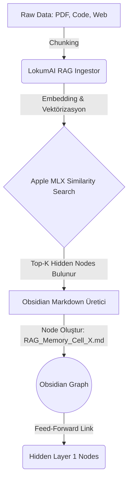

# LokumAI Bilişsel RAG ve Obsidian Entegrasyon Planı

## 1. Konsept ve Amaç
Bu doküman, LokumAI'nin geleneksel RAG (Retrieval-Augmented Generation) sistemini, Obsidian üzerindeki **İleri Beslemeli Sinir Ağı (Feed-Forward Neural Network)** yapısıyla nasıl entegre edeceğini tanımlar.
LokumAI yeni bir veri (örneğin bir PDF, kod parçası veya web makalesi) okuduğunda (ingestion), bu veriyi salt bir vektör veritabanına kaydetmek yerine, onu Obsidian Graph'ına **yeni bir sinir hücresi (node)** olarak ekleyecektir.

## 2. Mimari Tasarım: Bellek Hücreleri (Memory Cells)
RAG'dan gelen veriler ağın neresine eklenecek? Geleneksel Feed-Forward ağlarda dışarıdan gelen veriler Input katmanından girer. Bilişsel ağ modelimizde:
1. **RAG Intake (Memory Cell):** LokumAI'nin okuduğu her bir "Chunk" (metin parçası) Obsidian'da `RAG_Memory_Cell_[ID].md` formatında yeni bir node oluşturur.
2. **Tagging:** Bu node'lara `#rag/memory_cell` ve `#rag/training` etiketleri atanır.
3. **Bağlantı Stratejisi (Synaptic Pruning & Routing):**
   - RAG node'u, içeriğine en uygun `layer/hidden_1_feature_extraction` düğümlerine bağlanır (Örneğin, kod ile ilgiliyse `Instruction_Fetch_Analysis` node'una).
   - Bu eşleştirme (routing) işlemi, Apple MLX üzerinde çalışan hafif bir yerel LLM (veya embedding cosine similarity) kullanılarak yapılır. En yüksek benzerliği gösteren 3 veya 4 Hidden Layer 1 düğümüne `[[Link]]` verilir.

## 3. Veri Akışı (Data Pipeline)
LokumAI bir dokümanı eğittiğinde çalışacak Pipeline şu şekildedir:

## 4. Teknik Gereksinimler ve M5 Pro Optimizasyonu
- **Zero-Copy Processing:** RAG chunking ve embedding işlemleri sırasında, veriler CPU (RAM) ile GPU (VRAM) arasında kopyalanmadan Apple UMA (Unified Memory Architecture) üzerinden doğrudan işlenecektir.
- **MLX Embedding:** Vektörel benzerlik araması (`Cosine Similarity`) Apple'ın kendi `mlx-arrays` yapısı üzerinden C++ / Metal Shader hızlandırmasıyla hesaplanacaktır.
- **Dinamik Synapse Güncellemesi:** Zamanla çok fazla referans alan (okunan) `RAG_Memory_Cell` düğümleri, "Long Term Memory" (Uzun Süreli Bellek) statüsüne geçerek `hidden_2` katmanına da doğrudan (skip-connection) bağ kurabilecektir.

## 5. Uygulama Adımları (Next Steps)
1. `rag_ingestor_obsidian.py` adında yeni bir Python scripti oluşturulacak.
2. Script, verilen bir `.txt` veya `.md` dosyasını paragraflara bölecek (Chunking).
3. Apple MLX tabanlı bir embedding modeli kullanılarak her chunk için vektör çıkarılacak.
4. Bu vektör, `upscale_ann.py` ile oluşturulan 25 adet `Hidden Layer 1` düğümünün konsept vektörleriyle karşılaştırılacak.
5. En uygun 3 düğüme `[[Link]]` veren yeni bir Markdown dosyası `Lokum1.0/Knowledge/` klasörüne kaydedilecek.

*Bu entegrasyon sayesinde LokumAI sadece veri depolamakla kalmayıp, veriyi doğrudan sentetik bilişsel ağının içerisine yapısal (structural) olarak örmüş (weave) olacaktır.*
